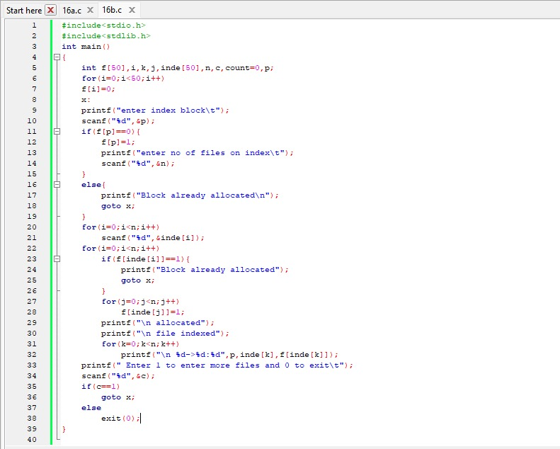
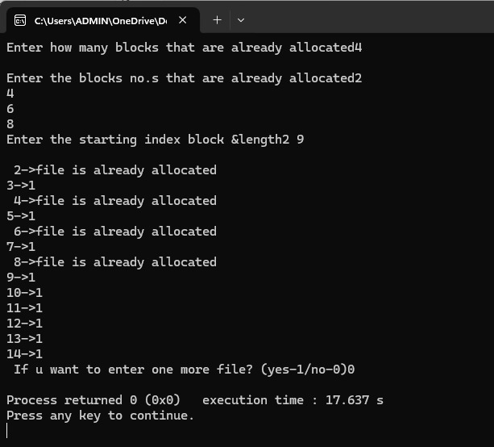

#SEQUENTIAL FILE ORAGANIZATION

# program file

# sample output

# tested output

#INDEXED FILE ORAGANIZATION

# program file

# sample output

# tested output

#LINKED FILE ORAGANIZATION

# program file

# sample output

# tested output

