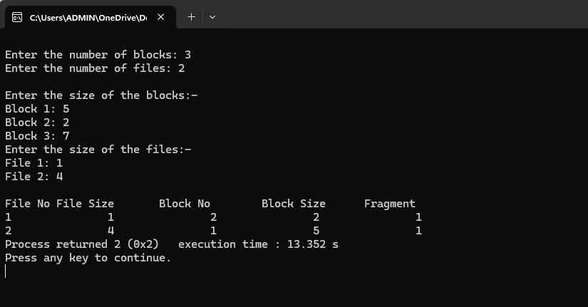
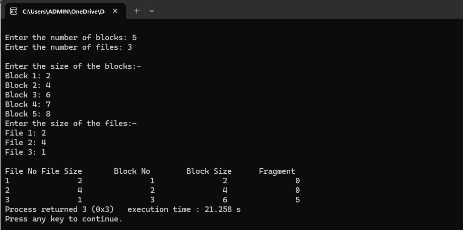

# COMPUTER-NETWORKS-AND-OPERATING-SYSTEMS-LAB
LAB PROGRAMS
# FCFS progran status
##program files of FCFS

##sample input and output of FCFS

##tested input and output of FCFS

# SJF progran status
##program files of SJF

##sample input and output of SJF

##tested input and output of SJF

# RoundRobin program status

##program files ofRoundRobin

##sample input and output of RoundRobin

##tested input and output of RoundRobin

# Priority program status

##program files of Priority

##sample input and output of Priority

##tested input and output of Priority

# MVT program status

##program files of MVT

##sample input and output of MVT

##tested input and output of MVT

# MFT program status

##program files of MFT

##sample input and output MFT

##tested input and output of MFT

# Producer&Consumer program status

##program files of Producer&Consumer

##sample input and output of Producer&Consumer

##tested input and output of Producer&Consumer

# Dining Philosopher program status

##program files of Dining Philosopher

##sample input and output of Dining Philosopher

##tested input and output of Dining Philosopher

# Worst Fit program status

##program files of WorstFit

##sample input and output of WorstFit

##tested input and output of WorstFit

# Best Fit program status

##program files of BestFit

##sample input and output of BestFit

##tested input and output of WorstFit

# First Fit program status

##program files of FirstFit

##sample input and output of FirstFit

##tested input and output of FirstFit

# FIFO Page Replacement Algorithm program status

##program files of FIFO Page Replacement Algorithm

##sample input and output of FIFO Page Replacement Algorithm

##tested input and output of FIFO Page Replacement Algorithm

# LRU Page Replacement Algorithm program status

##program files of LRU Replacement Algorithm

##sample input and output of LRU Page Replacement Algorithm

##tested input and output of LRU Page Replacement Algorithm

# Optimal Page Replacement Algorithm program status

##program files of  Optimal Replacement Algorithm

##sample input and output of Optimal Page Replacement Algorithm

##tested input and output of Optimal Page Replacement Algorithm

